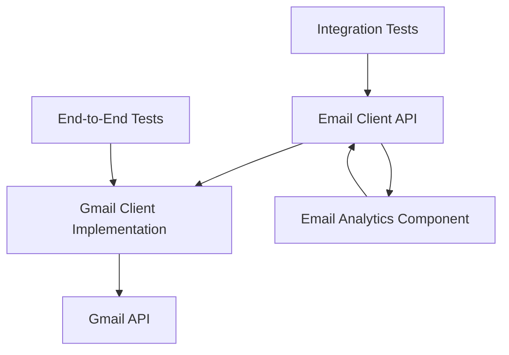

# Component Definition

## What is a Component?

A **component** is a functional aspect in a system that can be reasoned about in isolation. It represents a well-defined unit of functionality with clear boundaries, interfaces, and responsibilities. Components promote modularity, reusability, and maintainability in software systems.

### Key Characteristics of Components:

1. **Interface-driven**: Components interact through well-defined interfaces
2. **Encapsulation**: Internal implementation details are hidden from external consumers
3. **Isolation**: Can be developed, tested, and reasoned about independently
4. **Composability**: Can be combined with other components to build larger systems
5. **Substitutability**: Different implementations can be swapped as long as they adhere to the interface

## Email Client Components

This project demonstrates componentization through an email client system with the following components:

### 1. Email Client API (Interface Component)

**Location**: `src/email_client_api/`

**Purpose**: Defines the contract that all email client implementations must follow.

**Interface Definition**:

```python
from abc import ABC, abstractmethod
from typing import List, Dict, Optional

class EmailClient(ABC):
    """Abstract base class defining the email client interface."""
    
    @abstractmethod
    def send_email(self, recipient: str, subject: str, body: str) -> bool:
        """Send an email to a recipient.
        
        Args:
            recipient: Email address of the recipient
            subject: Subject line of the email
            body: Email body content
            
        Returns:
            bool: True if email was sent successfully, False otherwise
        """
        pass
    
    @abstractmethod
    def retrieve_emails(self, folder: str = "INBOX", limit: int = 10) -> List[Dict]:
        """Retrieve emails from a specified folder.
        
        Args:
            folder: Email folder to retrieve from (default: "INBOX")
            limit: Maximum number of emails to retrieve (default: 10)
            
        Returns:
            List[Dict]: List of email dictionaries containing id, subject, sender, etc.
        """
        pass
    
    @abstractmethod
    def delete_email(self, email_id: str) -> bool:
        """Delete an email by its ID.
        
        Args:
            email_id: Unique identifier of the email to delete
            
        Returns:
            bool: True if email was deleted successfully, False otherwise
        """
        pass
    
    @abstractmethod
    def mark_as_read(self, email_id: str) -> bool:
        """Mark an email as read.
        
        Args:
            email_id: Unique identifier of the email to mark as read
            
        Returns:
            bool: True if email was marked as read successfully, False otherwise
        """
        pass
```

### 2. Gmail Client Implementation Component

**Location**: `src/gmail_client_impl/`

**Purpose**: Concrete implementation of the email client interface using Gmail API.

**Key Features**:
- OAuth 2.0 authentication with Gmail
- Gmail API integration for all operations
- Error handling and logging
- Rate limiting compliance

### 3. Email Analytics Component (Extra Credit)

**Location**: `src/email_analytics/`

**Purpose**: Provides analytics and reporting capabilities for email data.

## Component Interaction



## Interface Contract

### Email Data Format

All components must adhere to the following email data structure:

```python
{
    "id": str,              # Unique email identifier
    "subject": str,         # Email subject line
    "sender": str,          # Sender email address
    "recipient": str,       # Recipient email address
    "body": str,           # Email body content
    "timestamp": str,       # ISO format timestamp
    "is_read": bool,       # Read status
    "folder": str,         # Folder location
    "attachments": List[Dict]  # Attachment metadata
}
```

### Error Handling

Components should implement consistent error handling:

- Return `False` for boolean operations that fail
- Return empty lists/dicts for retrieval operations that fail
- Log errors appropriately without exposing sensitive information
- Raise specific exceptions for authentication and API errors

### Testing Contract

Each component must include:

1. **Unit Tests**: Test individual methods in isolation
2. **Interface Tests**: Verify adherence to the abstract interface
3. **Integration Tests**: Test component interactions
4. **Mock Tests**: Test with mocked external dependencies

## Benefits of This Component Architecture

1. **Flexibility**: Easy to swap Gmail implementation with other email providers
2. **Testability**: Each component can be tested independently
3. **Maintainability**: Clear separation of concerns
4. **Extensibility**: New features can be added as separate components
5. **Reusability**: Components can be used in different contexts 